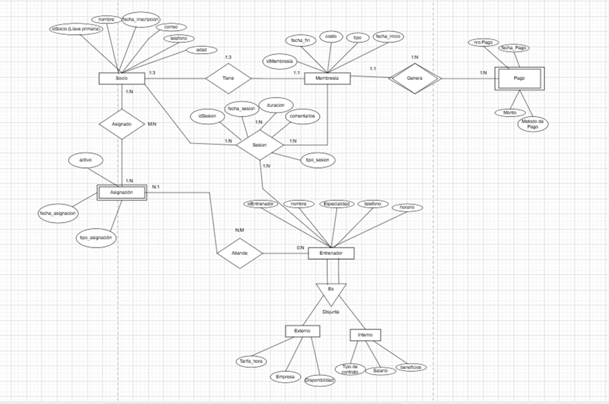
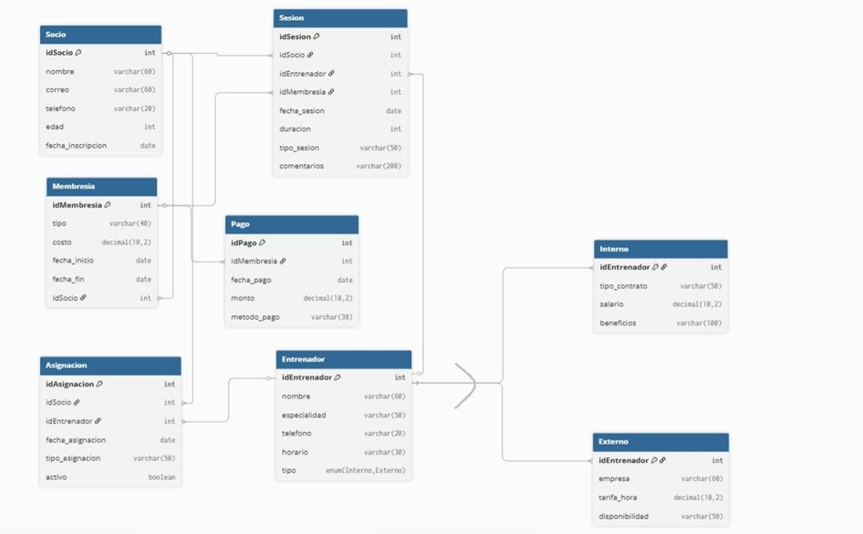
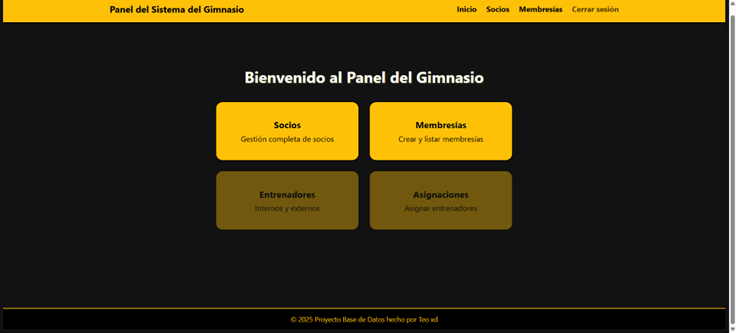
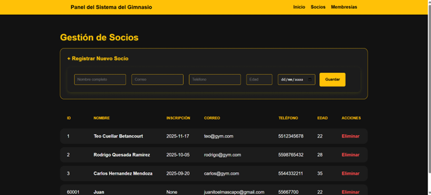
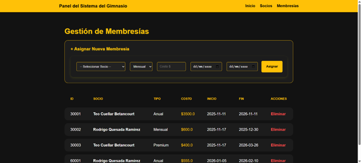

# 🏋️‍♂️ Sistema de Gestión de Información para Gimnasio

Aplicación web desarrollada con **Python**, **MySQL** y **HTML/CSS** para la administración básica de usuarios, socios y membresías dentro de un gimnasio.

Incluye autenticación, dashboard, vistas estáticas para GitHub Pages y API funcional para despliegue en servidor.

---

## 🚀 Tecnologías utilizadas

- **Backend:** Python
- **Base de Datos:** MySQL
- **Frontend:** HTML5 y CSS3 (Grid Layout)

---

## 📌 Características principales

- Inicio de sesión con validación
- Dashboard principal después de autenticarse
- Gestión de socios
- Gestión de membresías
- Estructura modular lista para futuras expansiones
- Versión estática para demostración en GitHub Pages
- Deploy funcional en Render

---

## 📂 Estructura del proyecto
```
gym-api-python/ <-- Directorio Raíz
│
├── app.py <-- Controlador Principal (Entry Point)
├── requirements.txt <-- Dependencias y Librerías del Entorno
├── README.md <-- Documentación General del Proyecto
├── .gitignore <-- Archivos excluidos del control de versiones
│
├── static/ <-- Recursos Estáticos (Producción)
│ └── css/
│ └── estilo.css <-- Hoja de estilos global
│
├── templates/ <-- Vistas Dinámicas (Jinja2)
│ ├── index.html <-- Dashboard principal
│ ├── socios.html <-- CRUD de Socios
│ └── membresias.html <-- CRUD de Membresías
│
└── docs/ <-- Despliegue Estático (GitHub Pages)
├── index.html <-- Demo estática del Dashboard
├── socios.html <-- Demo estática de Socios
├── membresias.html <-- Demo estática de Membresías
└── css/
└── estilo.css

```


---

## 📊 Diagramas del Sistema

### 🔷 Diagrama EER


---

### 🔶 Diagrama Relacional


---

## 📸 Capturas de Pantalla

### 🖥️ Inicio de Sesión


---

### 👥 Módulo de Socios


---

### 🧾 Módulo de Membresías


---

## 🌐 Enlaces Importantes

🔹 **Código Fuente:**  
https://github.com/davidcuellarbt-hue/gym-api-python  

🔹 **Demo Estática (GitHub Pages):**  
https://davidcuellarbt-hue.github.io/gym-api-python/  

🔹 **Demo en Vivo (Render):**  
https://gym-api-python.onrender.com  


   
